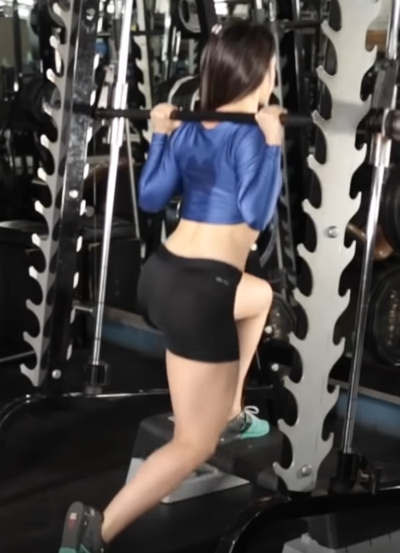
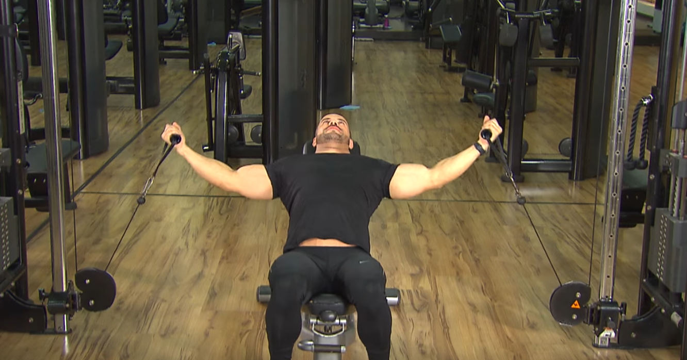
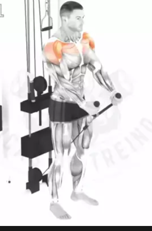
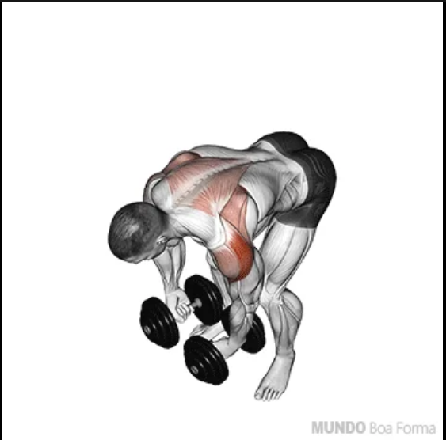
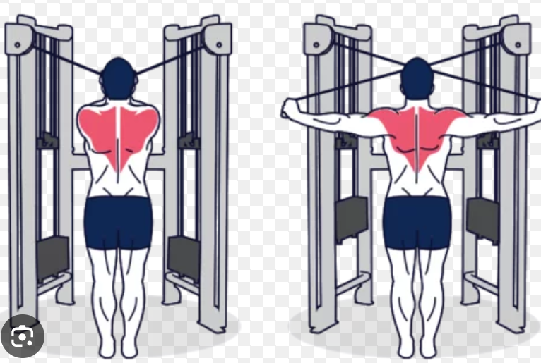
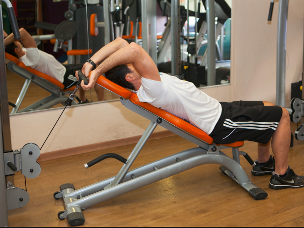
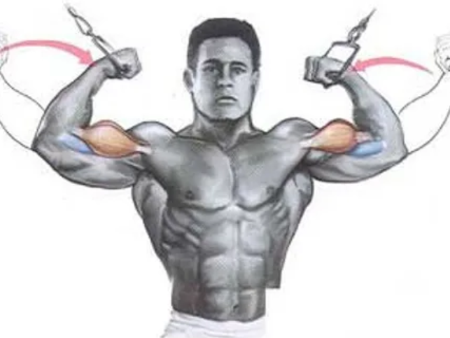

# Pernas
- Extensor com 2 segundos de pico de contracao (4x8)
- Agachamento livre (4x8)
- Leg press (4x8)
- Hack squat (3x8)
- Extensor deitado com 2 secs pico de contracao (3x8)
- Smith fundo com step (5x8)
  
- Whip trust (3x8)
# Abs, Peito e Ombros
- Dragon flags 3xRM
- Abdominal com elevacao do quadril 3xRM
- Abdominal cadeira joelhos acima da cintura 3xRM
- Supino inclinado halteres (4x8)
- Supino reto halteres (3x8)
- Supino declinado (de cabeca para baixo) (3x8)
- Crucifixo-inclinado (3x8)
  
- Flys 2 sec pico (1x)
- Elevacao frontal em pe com corda (3x8)
  
- Elevacao lateral sentado (3x8)
- Flexor sentado 2 secs pico de contraçao (3x8)(puxar para trás)
# Costas
- Puxada com barra (4x8)
- Remada baixa com triangulo (3x8)
- Remada baixa com pegada aberta (3x8)
- Puxada de cima com 2 secs de contraçao (4x8)
- Serrote (4x8)
- Crucifixo inverso halteres 2 secs contracao (RM)

- Lombar no banco com peso (4x8)
- Romanian deadlifts (3x8)
  
DESCANSO
# Posteriores
- Flexor deitado (4x8)
- Flexor sentado pico contracao 3s (Posterior que parece quadricep)(3x8)
- Romanian deadlifts (3x8)
- Smith fundo com step (3x8)
  
- Terra sumo com alteres (RM)
- Whip trust (3x8)
- Abdutor (3 secs pico de contracao) (3x8)
- Elevacao frontal sentado com halteres (3x8)
# Panturrilhas,Ombros e Peitos
- Maquina panturrilha (8x8)
- Sholder press halteres (3x8)
- Elevacao lateral halteres (3x8)
- Elevacao lateral deitado de lado no banco (alternado)(3x8)
- Elevacao lateral cabos (alternado)(3x8)
- Elevacao frontal com barra (ombros barra para cima) (3x8)
- Elevacao frontal em pé com o cable das tranças a passar por baixo das pernas (3x8)
- Supino inclinado (4x8)
- Crucifixo inverso no cabo (3x8)
  
- Flexor deitado (harmstring)(3x8)
# Abs e Braços
- Dragon flags 3xRM
- Abdominal com elevacao do quadril 3xRM
- Abdominal cadeira joelhos acima da cintura 3xRM
- Triceps testa banco 45º (4x8)
  
- Triceps corda baixo (4x8)
- Tricep corda para trás (4x8)
- Tricep dips
- Rosca scoth (rosca inclinada com apoio) (4x8)
- Rosca direta barra livre (4x8)
- Rosca no cabo (4x8)
- Rosca duplo biceps cross

- Elevacao frontal em pé com corda ombro (3x8)
- Flexor sentado (2sec pico)(3x10)