# TRAINING PLAN FOR REGULAR GYM
## 1. DAY [Chest & Tricep]
### Chest
- Inclined bench press [5x12 [2 Slower, 4 Fast]]
- Normal bench press [5x12 [2 Slower,4 Fast]]
- Inclined dumbell press [5x12 [2 slower, 4 Fast]]
- Machine Fly [5x12 [2 Slower,4 Fast]]
  
  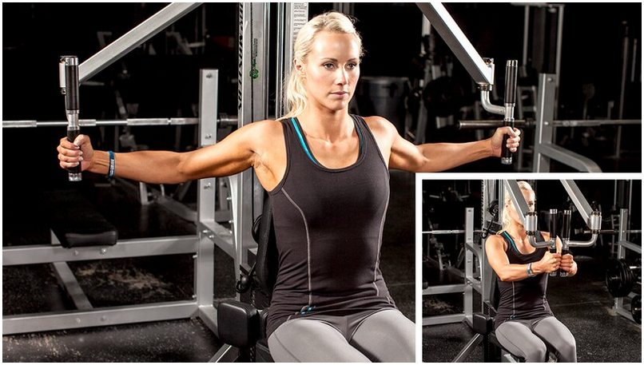
- Cable cross-over 
  
  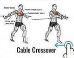
## Tricep
- Dips [5x12 [2 Slower,4 Fast]]
- Triceps Machine Dip [5x12 [2 Slower,4 Fast]]
  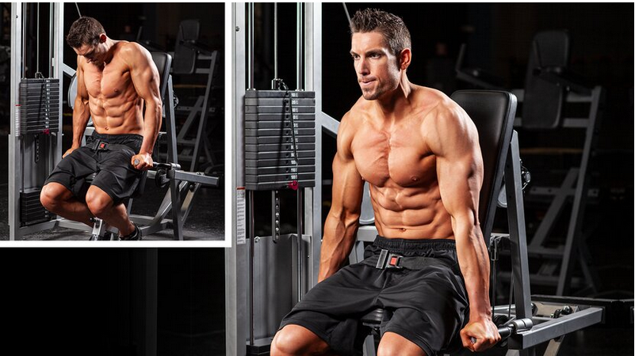
- Single-Arm dumbell kick-back [5x12 [2 Slower,4 Fast]]
  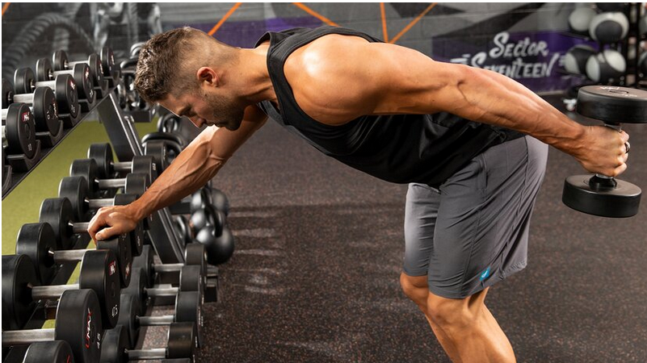
- Cable Push-down [5x12 [2 Slower,4 Fast]]
  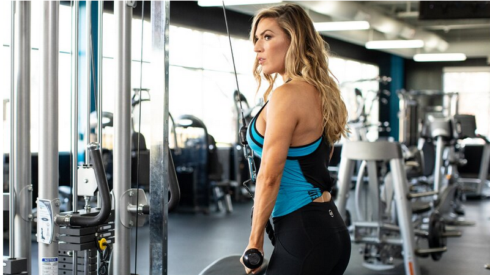
- Skullcrusher [5x12 [2 Slower,4 Fast]]
  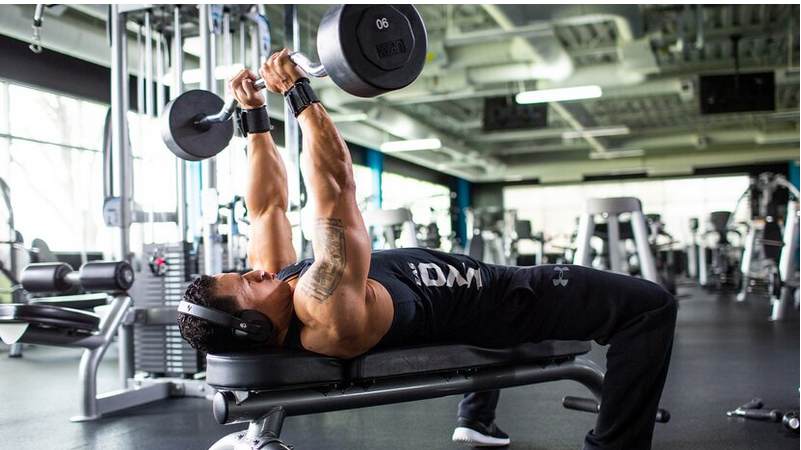
## 2. DAY [Back & Bicep]
### Back
- Bent-Over Row [5x12 [2 Slower,4 Fast]]
  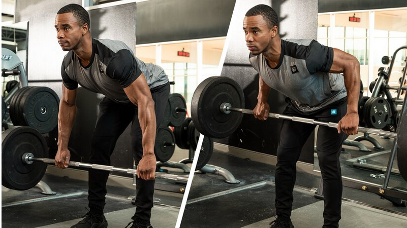
- T-Bar Row [5x12 [2 Slower,4 Fast]]
  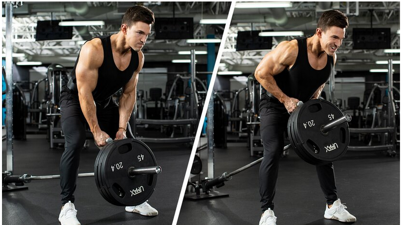
- Seated Row [5x12 [2 Slower,4 Fast]]
  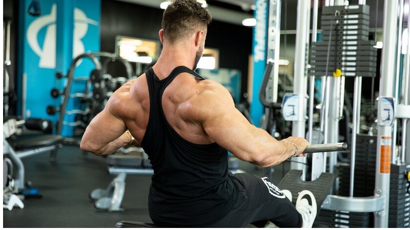
- Lat Pull-Down [5x12 [2 Slower,4 Fast]]
  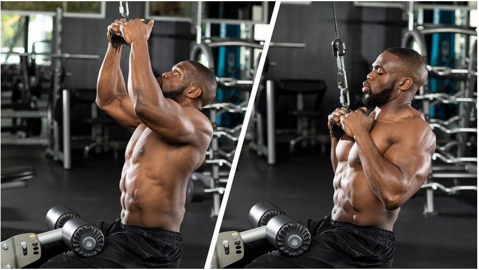
- Single-Arm Dumbbell Row [5x12 [2 Slower,4 Fast]]
  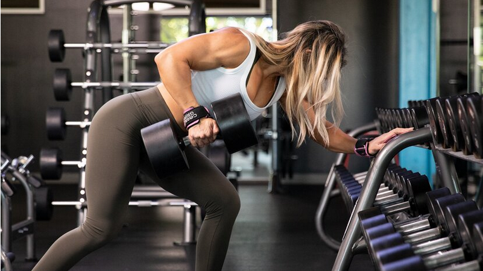
### Bicep
- Chinups [5x12]
- Dumbbell Curl [5x12 [2 Slower,4 Fast]]
  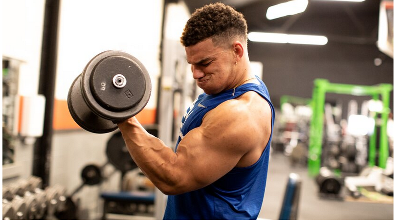
- Curved barbell [5x12 [2 Slower,4 Fast]]
  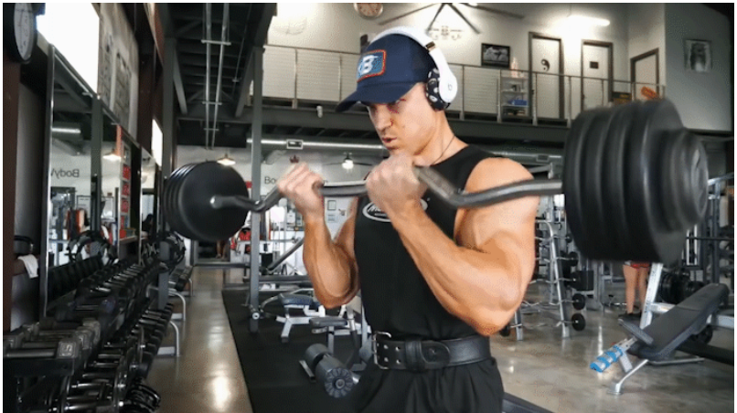
- Cable Curl [5x12 [2 Slower,4 Fast]]
  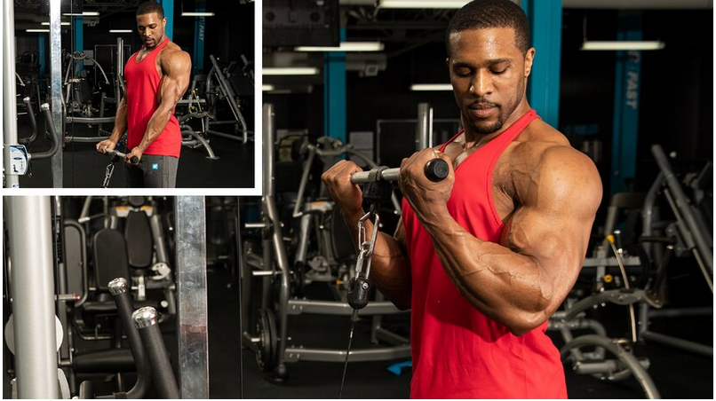
- Unnamed bicep [5x12 [2 Slower,4 Fast]]
  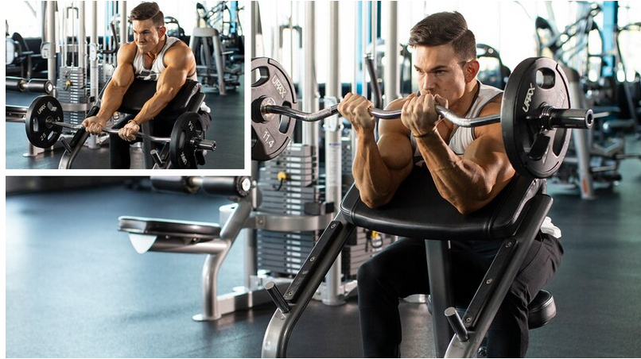
## 3. DAY [Quads]
- SUM Sets Barbell Squats [5x12]
- Front Foot Elevated Split Squats [5x12 [2 Slower,4 Fast]]
  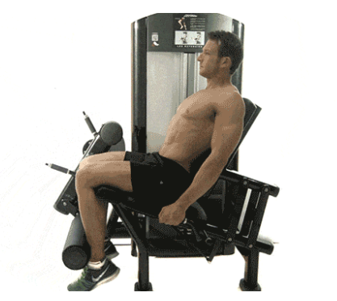
- Leg Press [5x12 [2 Slower,4 Fast]]
  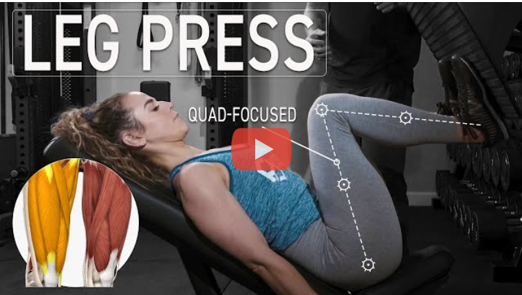
- Hack Squat
  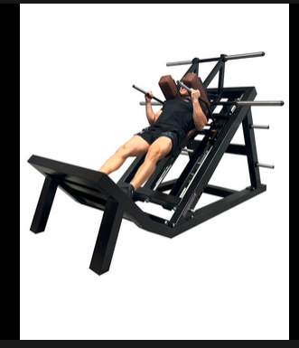
## 4. DAY [Harmstring && Sholder]
### Harmstring
- Dumbell good mornings [5x12 [2 Slower,4 Fast]]
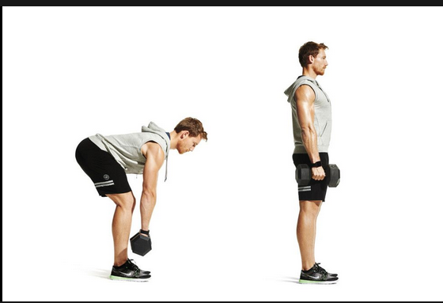
- Single arm good mornings [5x12 [2 Slower,4 Fast]]
- Lying Leg Curl [5x12 [2 Slower,4 Fast]]
  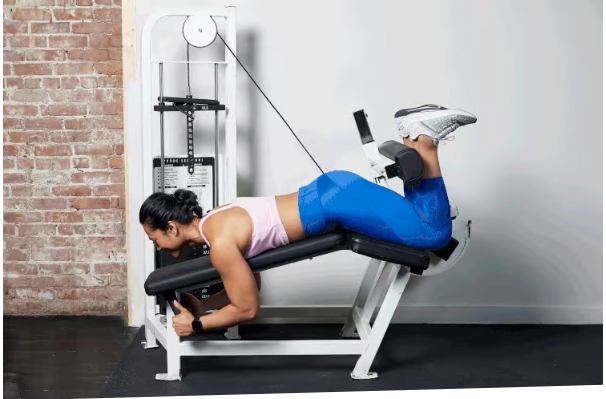
- Hex-Bar [5x12 [2 Slower,4 Fast]]
  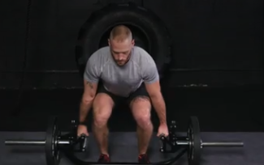
- Razor curls [5x12 [2 Slower,4 Fast]]
  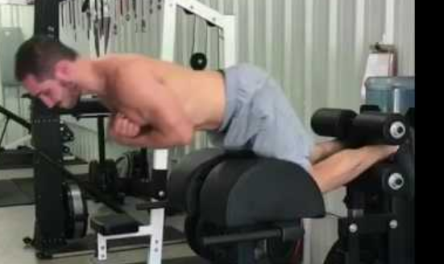
### Sholder
- Leaning Lateral Raise [5x12 [2 Slower,4 Fast]]
  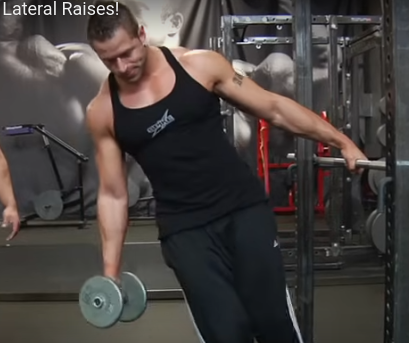
- Lateral Raise [5x12 [2 Slower,4 Fast]]
  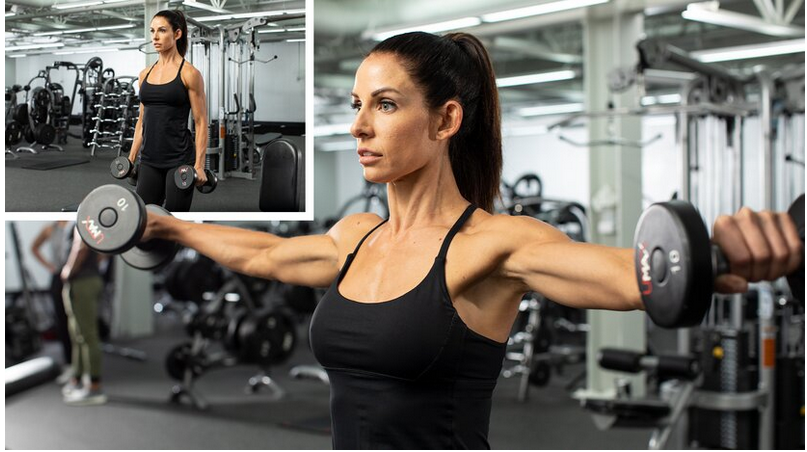
- Barbell Overhead Press [5x12 [2 Slower,4 Fast]]
  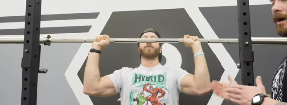
- Cable Lateral Raise [5x12 [2 Slower,4 Fast]]
  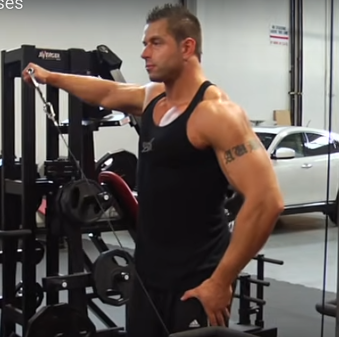
- Front Rase [5x12 [2 Slower,4 Fast]]
  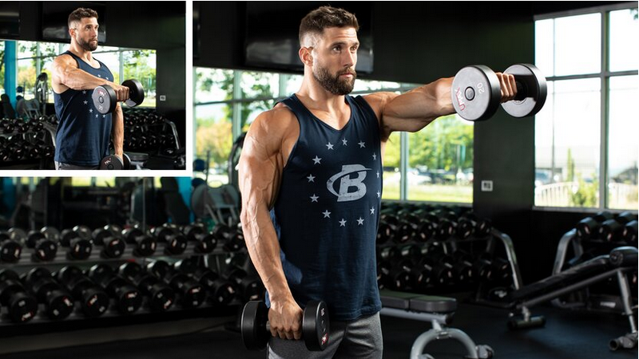
## 5. DAY [Glutes && Abs]
### Glutes
- Smith [5x12 [2 Slower,4 Fast]]
  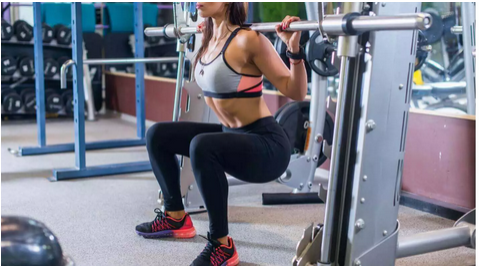
- Cadeira Abdutora [5x12 [2 Slower,4 Fast]]
  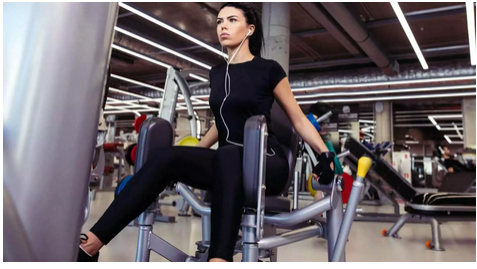
- Hip Thrust [5x12 [2 Slower,4 Fast]]
  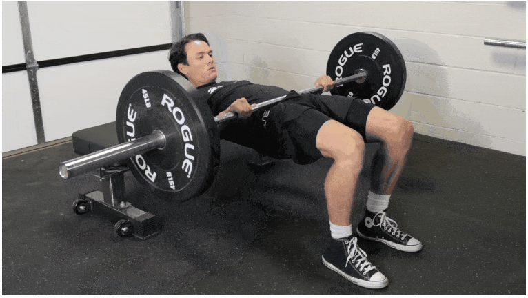
- Cable Glute KickBack [5x12 [2 Slower,4 Fast]]
  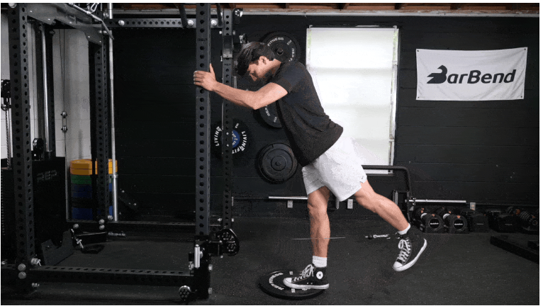
- Planche kick back [5x12 [2 Slower,4 Fast]]
  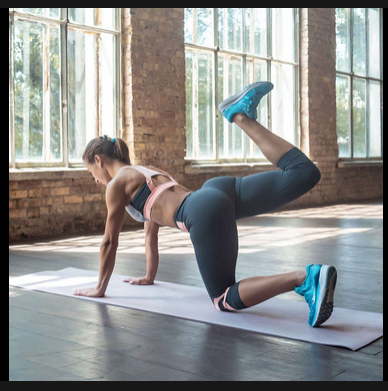
### Abs
- Dragon Flags [5x12 [2 Slower,4 Fast]]
- Touch the shoulders [5x12 [2 Slower,4 Fast]]
- Touch the feet [5x12 [2 Slower,4 Fast]]
- Normal Leg Elevation [5x12 [2 Slower,4 Fast]]
- 500 ABS [5x12 [2 Slower,4 Fast]]
## CALISTHENICS DAY AT SUNDAYS [FIXED]