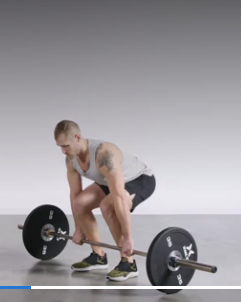

# TRAINING PLAN FOR REGULAR GYM
## 1. DAY [Chest & Tricep]
### Chest
- Inclined bench press [5x12 [2 Slower, 4 Fast]]
- Normal bench press [5x12 [2 Slower,4 Fast]]
- Cable cross-over down [5x12 [2 Slower,4 Fast]]
- Cable cross-over [5x12 [2 Slower,4 Fast]]
  
- Machine Fly [5x12 [2 Slower,4 Fast]]
  
## Tricep
- Dips [5x12 [2 Slower,4 Fast]]
- Triceps Machine Dip [5x12 [2 Slower,4 Fast]]
  
- Single-Arm dumbell kick-back [5x12 [2 Slower,4 Fast]]
  
- Cable Push-down [5x12 [2 Slower,4 Fast]]
  
- Dumbells skullcrusher [5x12 [2 Slower,4 Fast]]
## 2. DAY [Back & Bicep]
### Back
- Bent-Over Row [5x12 [2 Slower,4 Fast]]
  
- T-Bar Row [5x12 [2 Slower,4 Fast]]
  
- Seated Row [5x12 [2 Slower,4 Fast]]
  
- Lat Pull-Down [5x12 [2 Slower,4 Fast]]
  
- Single-Arm Dumbbell Row [5x12 [2 Slower,4 Fast]]
  
### Bicep
- Chinups [5x12]
- Dumbbell Curl [5x12 [2 Slower,4 Fast]]
  
- Cable Curl [5x12 [2 Slower,4 Fast]]
  
- Curl inclined machine [5x12 [2 Slower,4 Fast]]
- Unnamed bicep [5x12 [2 Slower,4 Fast]]
  
## 3. DAY [Quads && Sholder]
### Quads
- SUM Sets Barbell Squats [5x12]
- Front Foot Elevated Split Squats [5x12 [2 Slower,4 Fast]]
  
- Leg Press [5x12 [2 Slower,4 Fast]]
  
- Hack Squat [5x12 [2 Slower,4 Fast]]
  
- Alternated leg front foot elevated split squats [5x12 [2 Slower,4 Fast]]
  
### Sholder
- Leaning Lateral Raise [5x12 [2 Slower,4 Fast]]
  
- Lateral Raise [5x12 [2 Slower,4 Fast]]
  
- Barbell Overhead Press [5x12 [2 Slower,4 Fast]]
  
- Cable Lateral Raise [5x12 [2 Slower,4 Fast]]
  
- Front Rase [5x12 [2 Slower,4 Fast]]
  
## 4. DAY [Harmstring && Glutes]
### Harmstring
- Dead Lift [5x12 [2 Slower,4 Fast]] (cu para baixo $\$)
  
- Romanian Deadlift (same as goodmorning, keep bar in the knees) [5x12 [2 Slower,4 Fast]]
- Single leg Good mornings [5x12]
- Lying Leg Curl [5x12 [2 Slower,4 Fast]]
  
- Lying Leg Curl alternative leg [5x12 [2 Slower,4 Fast]]
  
### Glutes
- Hip Thrust [5x12 [2 Slower,4 Fast]]
  
- Glute KickBack [5x12 [2 Slower,4 Fast]]
  
- Cadeira Abdutora [5x12 [2 Slower,4 Fast]]
  
- Hack Squat low weight for reaching the ass to the ground [5x12 [2 Slower,4 Fast]]
- Squats low weight for reaching the ass on the ground [5x12 [2 Slower,4 Fast]]
## 5. DAY [Abs && Panturrilha && Soft calestenia]
### Abs
- Dragon Flags [5x12 [2 Slower,4 Fast]]
- Touch the shoulders [5x12 [2 Slower,4 Fast]]
- Touch the feet [5x12 [2 Slower,4 Fast]]
- Normal Leg Elevation [5x12 [2 Slower,4 Fast]]
- Maquina de abs [5x12[2 Slower,4 Fast]]
- Bar abs [5x12[2 Sloer 4 fast]]
- 500 ABS [5x12 [2 Slower,4 Fast]]
### Panturrilha
- Calves machine [OP] [5x12 [2 Slower,4 Fast]]
- Calves machine [OP] 1 alternative feet [5x12 [2 Slower,4 Fast]]
- Calves machine [Weaker] [5x12 [2 Slower,4 Fast]]
- Calves machine [Weaker] 1 alternative feet [5x12 [2 Slower,4 Fast]]
- Pull ups [5x12]
### Soft calestenia
- Pull ups
## CALISTHENICS DAY AT SUNDAYS [FIXED]